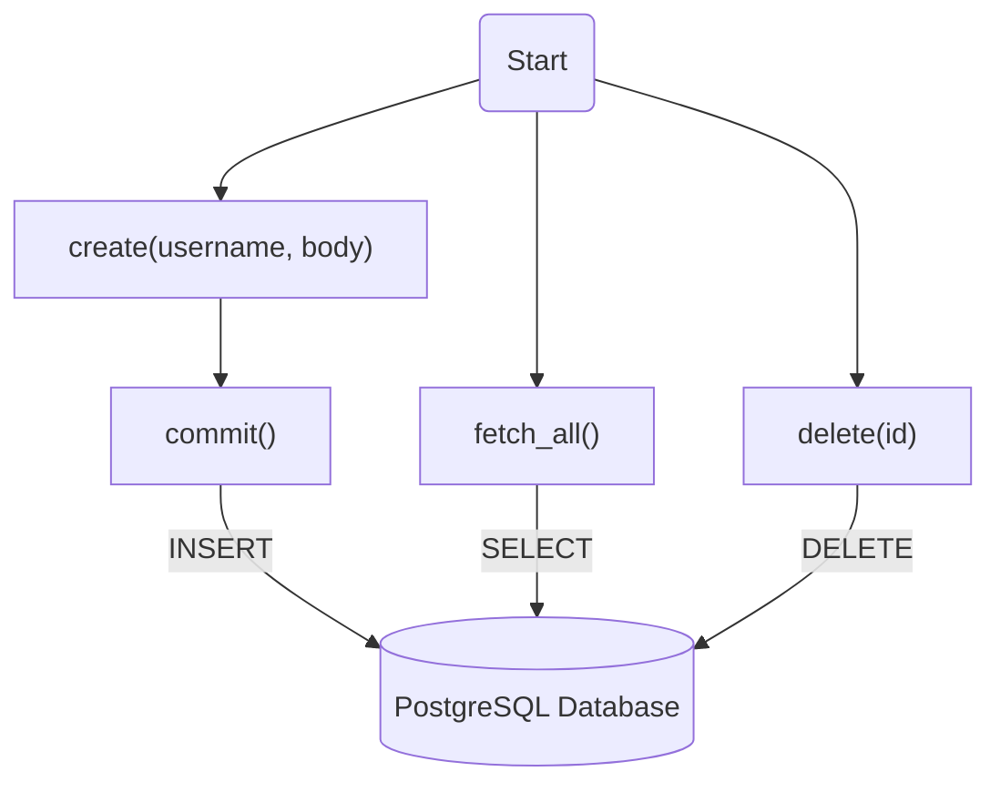
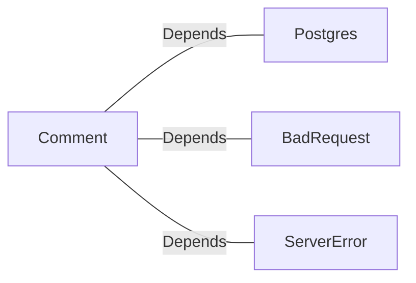
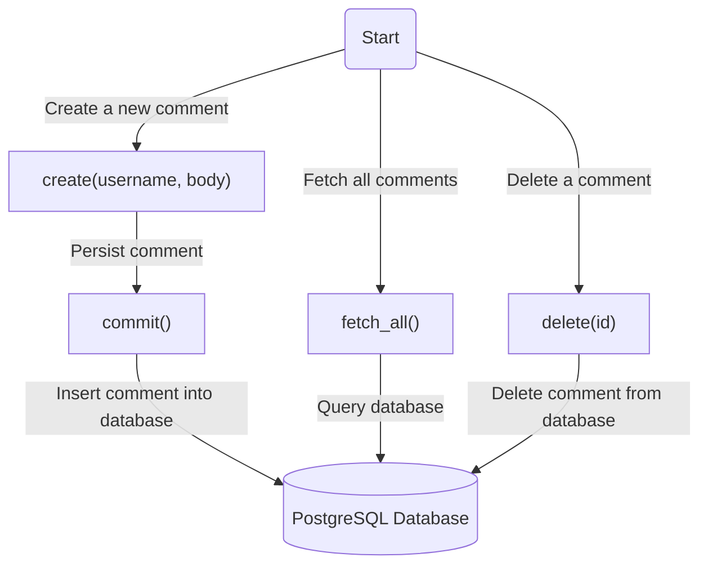
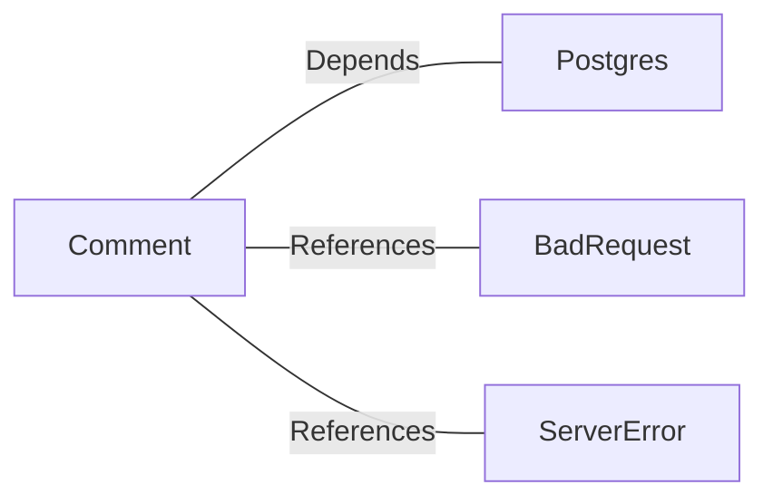

# Comment.java: Comment Management System

## Overview
The `Comment` class is responsible for managing user comments in a system. It provides functionality to create, fetch, and delete comments, as well as persisting them to a database. The class interacts with a PostgreSQL database to store and retrieve comment data.

## Process Flow

## Insights
- The class uses a PostgreSQL database for storing and retrieving comments.
- Each comment has attributes: `id`, `username`, `body`, and `created_on`.
- The `create` method generates a unique ID for each comment and timestamps it before saving it to the database.
- The `fetch_all` method retrieves all comments from the database.
- The `delete` method removes a comment from the database based on its ID.
- The `commit` method is a private helper function used to persist a comment to the database.
- Error handling is implemented using custom exceptions (`BadRequest` and `ServerError`).

## Dependencies

- `Postgres`: Provides database connection functionality.
- `BadRequest`: Used to handle errors when saving a comment fails.
- `ServerError`: Used to handle server-side errors.

## Data Manipulation (SQL)
### Table Structure: `comments`
| Attribute    | Data Type   | Description                          |
|--------------|-------------|--------------------------------------|
| `id`         | `VARCHAR`   | Unique identifier for the comment.  |
| `username`   | `VARCHAR`   | Username of the comment author.     |
| `body`       | `TEXT`      | Content of the comment.             |
| `created_on` | `TIMESTAMP` | Timestamp when the comment was created. |

### SQL Operations
- **INSERT**: Adds a new comment to the `comments` table.
- **SELECT**: Retrieves all comments from the `comments` table.
- **DELETE**: Removes a comment from the `comments` table based on its ID.
# Comment.java: Comment Management System

## Overview

The `Comment` class provides functionality for managing user comments in a system. It includes methods for creating, fetching, and deleting comments, as well as persisting them to a database. The class interacts with a PostgreSQL database to store and retrieve comment data.

## Process Flow

## Insights

- **Comment Object**: Represents a single comment with attributes `id`, `username`, `body`, and `created_on`.
- **Database Interaction**: The class heavily relies on a PostgreSQL database for storing and retrieving comments.
- **Error Handling**: Custom exceptions (`BadRequest`, `ServerError`) are used to handle errors during comment creation.
- **UUID for IDs**: Each comment is assigned a unique identifier using `UUID.randomUUID()`.
- **Timestamp**: Comments are timestamped using `java.sql.Timestamp` for tracking creation time.
- **Static Methods**: Methods like `create`, `fetch_all`, and `delete` are static, allowing direct access without instantiating the class.
- **SQL Injection Prevention**: Prepared statements are used for database operations to mitigate SQL injection risks.

## Dependencies

- `Postgres`: Provides the database connection for executing SQL queries.
- `BadRequest`: Used to throw an exception when comment creation fails.
- `ServerError`: Used to throw an exception for server-related errors.

## Data Manipulation (SQL)

### Table Structure: `comments`

| Attribute   | Data Type       | Description                          |
|-------------|-----------------|--------------------------------------|
| `id`        | `VARCHAR`       | Unique identifier for the comment.  |
| `username`  | `VARCHAR`       | Username of the comment author.     |
| `body`      | `TEXT`          | Content of the comment.             |
| `created_on`| `TIMESTAMP`     | Timestamp when the comment was created. |

### SQL Operations

- **INSERT**: Adds a new comment to the `comments` table.
  - `commit()`: Executes an `INSERT INTO comments (id, username, body, created_on)` query.
- **SELECT**: Retrieves all comments from the `comments` table.
  - `fetch_all()`: Executes a `SELECT * FROM comments` query.
- **DELETE**: Removes a comment from the `comments` table based on its `id`.
  - `delete(id)`: Executes a `DELETE FROM comments WHERE id = ?` query.
