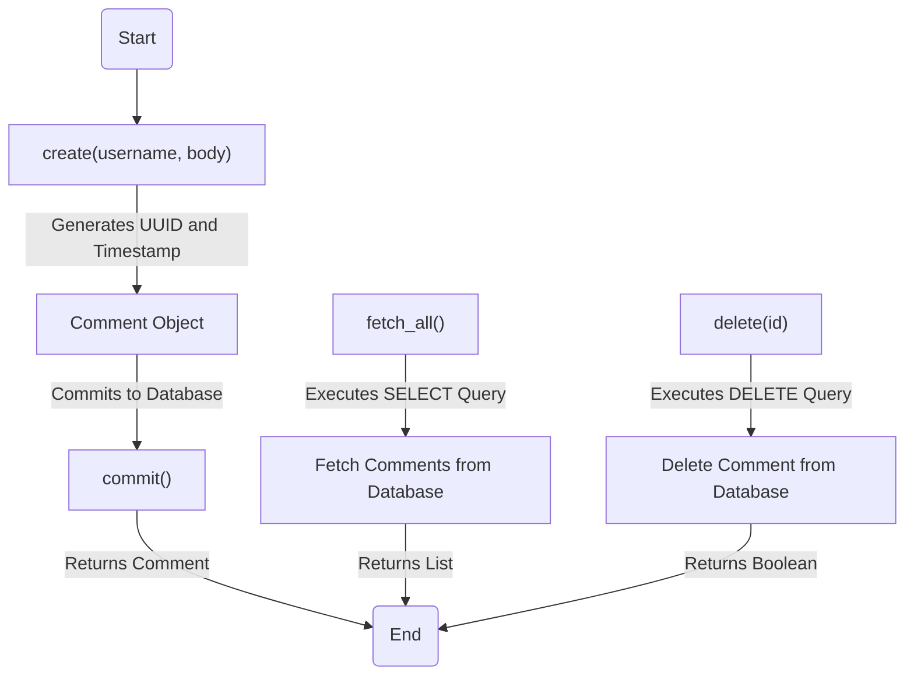
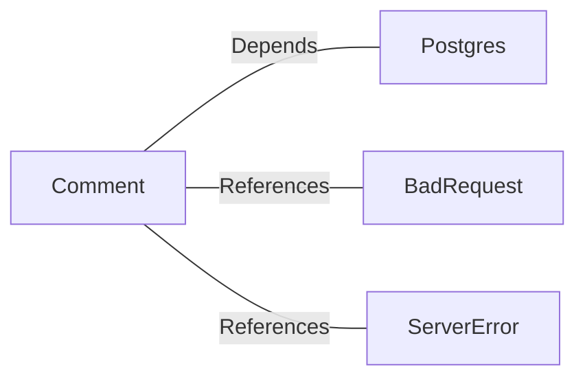

# Comment.java: Comment Management System

## Overview
The `Comment` class is responsible for managing comments in a system. It provides functionalities to create, fetch, and delete comments, as well as commit them to a database. The class interacts with a PostgreSQL database to store and retrieve comment data.

## Process Flow

## Insights
- **Comment Creation**:
  - Generates a unique ID using `UUID.randomUUID()`.
  - Captures the current timestamp using `Date` and `Timestamp`.
  - Commits the comment to the database using the `commit()` method.
  - Throws custom exceptions (`BadRequest`, `ServerError`) for error handling.

- **Fetching Comments**:
  - Executes a `SELECT` query to retrieve all comments from the database.
  - Maps the result set to `Comment` objects and returns a list of comments.

- **Deleting Comments**:
  - Executes a `DELETE` query to remove a comment by its ID.
  - Returns a boolean indicating success or failure.

- **Database Interaction**:
  - Uses `PreparedStatement` for SQL queries to prevent SQL injection.
  - Relies on a `Postgres.connection()` method to establish database connections.

- **Error Handling**:
  - Exceptions are caught and logged using `e.printStackTrace()`.

## Dependencies

- `Postgres`: Provides the `connection()` method to interact with the PostgreSQL database.
- `BadRequest`: Custom exception thrown when a comment cannot be saved.
- `ServerError`: Custom exception thrown for server-related errors.

## Data Manipulation (SQL)
### Table: `comments`
| Attribute   | Data Type   | Description                          |
|-------------|-------------|--------------------------------------|
| `id`        | `VARCHAR`   | Unique identifier for the comment.  |
| `username`  | `VARCHAR`   | Username of the commenter.          |
| `body`      | `TEXT`      | Content of the comment.             |
| `created_on`| `TIMESTAMP` | Timestamp when the comment was created. |

### SQL Operations
- **INSERT**: Adds a new comment to the `comments` table.
- **SELECT**: Retrieves all comments from the `comments` table.
- **DELETE**: Removes a comment from the `comments` table by its ID.

## Vulnerabilities
1. **SQL Injection Risk**:
   - The `fetch_all()` method uses `Statement` instead of `PreparedStatement`, making it vulnerable to SQL injection attacks.
   - Recommendation: Replace `Statement` with `PreparedStatement` and use parameterized queries.

2. **Improper Exception Handling**:
   - The `delete()` method always returns `false` in the `finally` block, even if the operation succeeds.
   - Recommendation: Remove the `finally` block or ensure the return value reflects the operation's success.

3. **Resource Management**:
   - Database connections and statements are not properly closed in the `fetch_all()` and `delete()` methods.
   - Recommendation: Use `try-with-resources` to ensure proper resource management.

4. **Error Logging**:
   - Exceptions are logged using `e.printStackTrace()`, which may expose sensitive information.
   - Recommendation: Use a logging framework to log errors securely.
