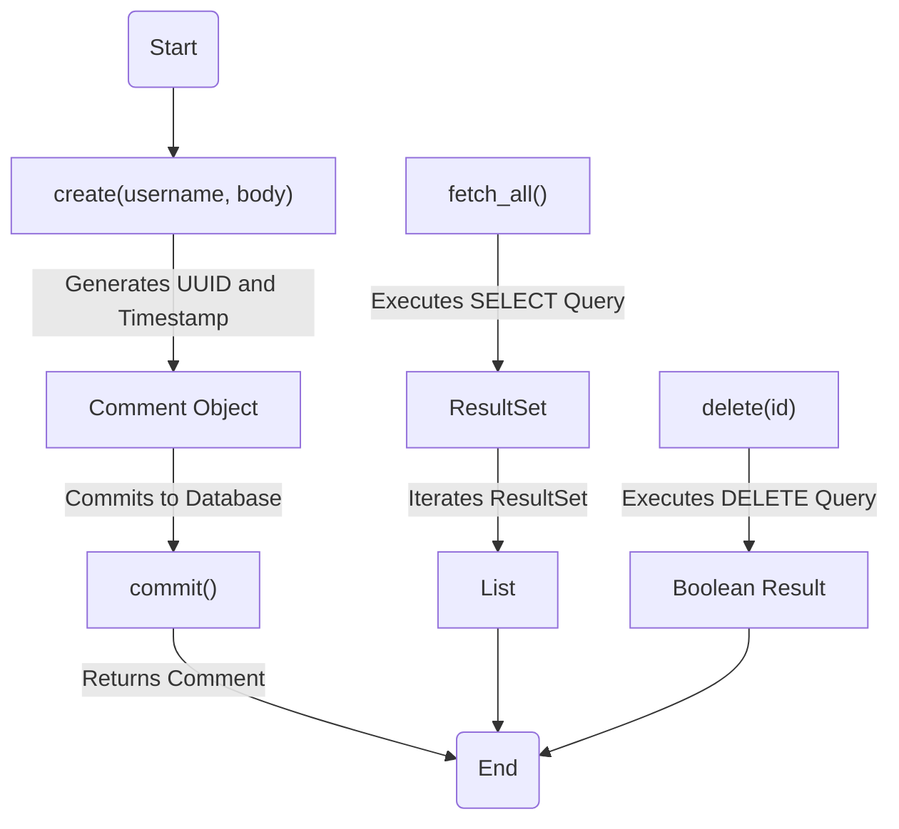
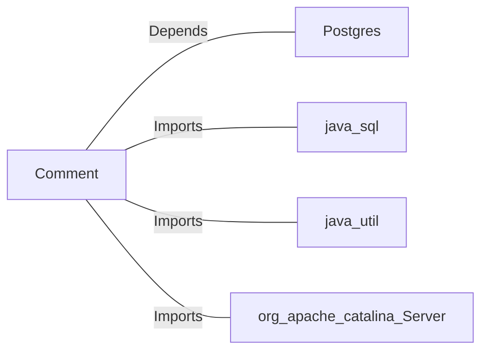

# Comment.java: Comment Management Class

## Overview
The `Comment` class is responsible for managing comments in an application. It provides methods to create, fetch, and delete comments, as well as commit them to a database. The class interacts with a PostgreSQL database to store and retrieve comment data.

## Process Flow

## Insights
- **Comment Creation**: The `create` method generates a unique ID and timestamp for each comment and commits it to the database. If the commit fails, it throws a `BadRequest` or `ServerError` exception.
- **Fetching Comments**: The `fetch_all` method retrieves all comments from the database using a `SELECT` query and returns them as a list of `Comment` objects.
- **Deleting Comments**: The `delete` method removes a comment from the database based on its ID using a `DELETE` query.
- **Database Interaction**: The class uses `PreparedStatement` for SQL queries, which helps prevent SQL injection in some cases but is not consistently applied across all methods.
- **Error Handling**: Exceptions are caught and printed, but the `delete` method always returns `false` due to the `finally` block overriding the result.

## Dependencies

- `Postgres`: Provides the database connection used for executing SQL queries.
- `java.sql`: Used for database interaction, including `Connection`, `Statement`, `PreparedStatement`, and `ResultSet`.
- `java.util`: Used for utility classes like `Date`, `List`, and `ArrayList`.
- `org.apache.catalina.Server`: Imported but not used in the code.

## Data Manipulation (SQL)
### Table: `comments`
| Attribute   | Data Type   | Description                          |
|-------------|-------------|--------------------------------------|
| `id`        | `VARCHAR`   | Unique identifier for the comment.  |
| `username`  | `VARCHAR`   | Username of the comment author.     |
| `body`      | `TEXT`      | Content of the comment.             |
| `created_on`| `TIMESTAMP` | Timestamp when the comment was created. |

### SQL Operations
- **INSERT**: Adds a new comment to the `comments` table.
- **SELECT**: Retrieves all comments from the `comments` table.
- **DELETE**: Removes a comment from the `comments` table based on its ID.

## Vulnerabilities
1. **SQL Injection Risk**:
   - The `fetch_all` method uses a `Statement` object with a raw SQL query (`select * from comments;`). This is vulnerable to SQL injection attacks. It should use `PreparedStatement` instead.
   
2. **Error Handling in `delete`**:
   - The `delete` method always returns `false` due to the `finally` block overriding the result. This makes it impossible to determine if the deletion was successful.

3. **Unnecessary Imports**:
   - The `org.apache.catalina.Server` import is unused and should be removed to avoid confusion.

4. **Potential Resource Leak**:
   - The `fetch_all` method does not properly close the `Statement` and `ResultSet` objects, which could lead to resource leaks.

5. **Exception Handling**:
   - Exceptions are caught and printed but not properly logged or rethrown in some cases, which can make debugging difficult.
