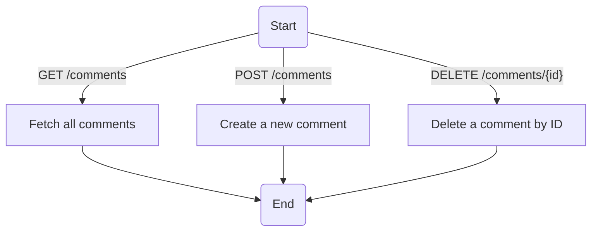
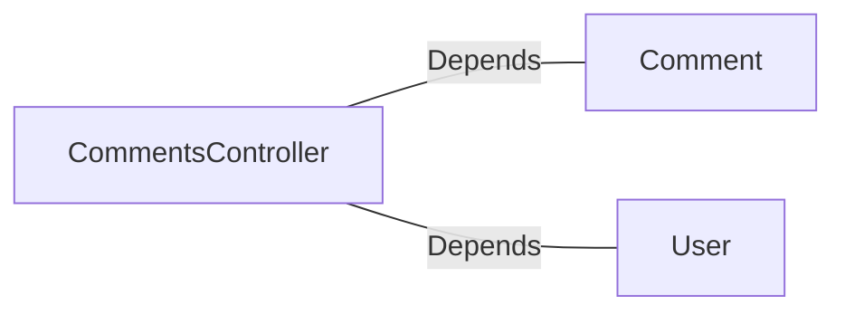

# CommentsController.java: REST API for Comment Management

## Overview
This file defines a Spring Boot REST controller for managing comments. It provides endpoints for retrieving, creating, and deleting comments. The controller includes authentication checks and handles HTTP requests with JSON payloads. Additionally, it defines custom exceptions for error handling.

## Process Flow

## Insights
- **Authentication**: The controller uses a custom authentication mechanism (`User.assertAuth`) to validate requests based on a secret key and an `x-auth-token` header.
- **Cross-Origin Resource Sharing (CORS)**: All endpoints allow requests from any origin (`@CrossOrigin(origins = "*")`), which may pose security risks if not properly configured.
- **Error Handling**: Custom exceptions (`BadRequest` and `ServerError`) are defined to handle specific error scenarios with appropriate HTTP status codes.
- **Serialization**: The `CommentRequest` class implements `Serializable` for handling JSON request payloads.
- **Endpoints**:
  - `GET /comments`: Fetches all comments.
  - `POST /comments`: Creates a new comment with a username and body.
  - `DELETE /comments/{id}`: Deletes a comment by its ID.

## Dependencies

- `Comment`: Used for fetching, creating, and deleting comments.
- `User`: Used for authentication (`assertAuth` method).

## Vulnerabilities
1. **Hardcoded Secret**: The `secret` is injected via `@Value("${app.secret}")`. If the secret is not securely managed, it could lead to unauthorized access.
2. **CORS Misconfiguration**: Allowing all origins (`@CrossOrigin(origins = "*")`) can expose the API to cross-origin attacks.
3. **Authentication Bypass**: The `User.assertAuth` method is used for authentication, but its implementation is not shown. If it is weak or improperly implemented, it could lead to security vulnerabilities.
4. **Error Handling**: The custom exceptions (`BadRequest` and `ServerError`) do not log errors or provide detailed information, which could make debugging difficult.
5. **No Input Validation**: The `CommentRequest` class does not validate the `username` or `body` fields, potentially allowing malicious input.
6. **No Rate Limiting**: The endpoints do not implement rate limiting, making them susceptible to abuse or denial-of-service attacks.

## Data Manipulation (SQL)
- **Comment**: Likely interacts with a database for fetching, creating, and deleting comments. However, the actual SQL operations are not shown in the code.
