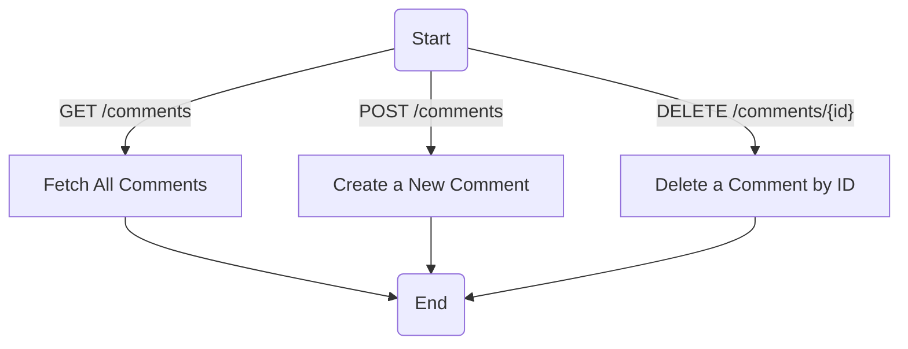
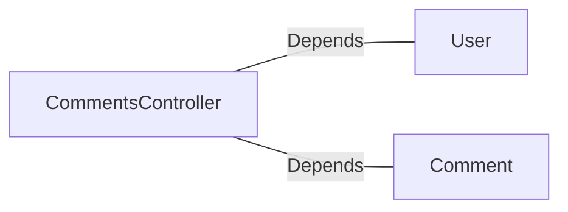

# CommentsController.java: REST API for Comment Management

## Overview
This file defines a Spring Boot REST controller for managing comments. It provides endpoints to fetch, create, and delete comments. The controller includes basic authentication using a secret token and handles errors with custom exceptions.

## Process Flow

## Insights
- **Authentication**: The controller uses a secret token (`x-auth-token`) for authentication, validated via `User.assertAuth`.
- **Endpoints**:
  - `GET /comments`: Fetches all comments.
  - `POST /comments`: Creates a new comment with a username and body.
  - `DELETE /comments/{id}`: Deletes a comment by its ID.
- **Cross-Origin Resource Sharing (CORS)**: All endpoints allow requests from any origin (`@CrossOrigin(origins = "*")`).
- **Error Handling**: Custom exceptions (`BadRequest`, `ServerError`) are used to handle specific error scenarios with appropriate HTTP status codes.
- **Data Structure**:
  - `CommentRequest`: Represents the input for creating a comment, containing `username` and `body`.

## Dependencies

- `User`: Used for authentication via `assertAuth(secret, token)`.
- `Comment`: Provides methods for fetching, creating, and deleting comments.

### List of Identified External References
- `User`: Validates the authentication token using the secret key.
- `Comment`: 
  - `fetch_all()`: Retrieves all comments.
  - `create(username, body)`: Creates a new comment.
  - `delete(id)`: Deletes a comment by its ID.

## Vulnerabilities
1. **Hardcoded Secret Exposure**:
   - The `secret` is injected from application properties (`@Value("${app.secret}")`). If improperly secured, it could be exposed, leading to authentication bypass.

2. **CORS Misconfiguration**:
   - Allowing all origins (`@CrossOrigin(origins = "*")`) can expose the API to unauthorized cross-origin requests, increasing the risk of CSRF attacks.

3. **Authentication Logic**:
   - The `User.assertAuth` method is used for authentication, but its implementation is not shown. If it lacks proper validation mechanisms, it could lead to security vulnerabilities.

4. **Error Handling**:
   - The custom exceptions (`BadRequest`, `ServerError`) do not provide detailed error messages or logging, which could hinder debugging and monitoring.

5. **Input Validation**:
   - The `CommentRequest` class does not validate `username` or `body`. This could lead to injection attacks (e.g., SQL injection, XSS) if the `Comment.create` method does not sanitize inputs.

6. **Token Exposure**:
   - The `x-auth-token` is passed in the header, which could be intercepted if HTTPS is not enforced.

## Data Manipulation (SQL)
- **Comment**: Likely interacts with a database to perform CRUD operations. However, the actual SQL operations are not shown in the code.
