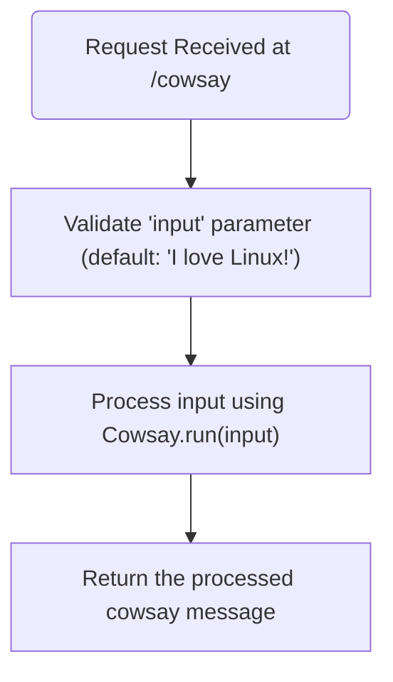
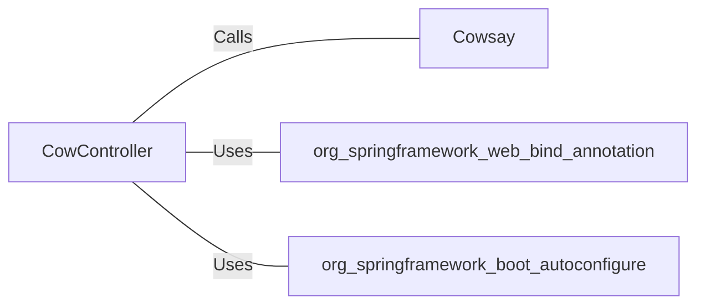

# CowController.java: REST Controller for CowSay Functionality

## Overview
The `CowController` class is a Spring Boot REST controller that provides an endpoint for generating "cowsay" messages. It accepts user input via a query parameter and processes it using the `Cowsay.run` method.

## Process Flow

## Insights
- The class is annotated with `@RestController` and `@EnableAutoConfiguration`, making it a Spring Boot REST controller with auto-configuration enabled.
- The `/cowsay` endpoint accepts a query parameter `input` with a default value of `"I love Linux!"`.
- The `Cowsay.run` method is used to process the input and generate the cowsay message.
- The code does not perform any sanitization or validation of the `input` parameter beyond setting a default value, which could lead to potential vulnerabilities.

## Vulnerabilities
1. **Potential Command Injection**:
   - If the `Cowsay.run` method executes system commands or interacts with external processes, unsanitized user input could lead to command injection vulnerabilities.
   - Example: If `Cowsay.run` directly passes the `input` parameter to a shell command, malicious input could execute arbitrary commands.

2. **Lack of Input Validation**:
   - The `input` parameter is directly passed to `Cowsay.run` without any validation or sanitization. This could lead to unexpected behavior or security issues depending on the implementation of `Cowsay.run`.

3. **Denial of Service (DoS)**:
   - If the `input` parameter allows excessively large strings, it could lead to performance degradation or memory exhaustion.

## Dependencies

- `Cowsay`: Processes the `input` parameter to generate the cowsay message.
- `org.springframework.web.bind.annotation`: Provides annotations for mapping HTTP requests to handler methods.
- `org.springframework.boot.autoconfigure`: Enables Spring Boot auto-configuration.

## External References
- `Cowsay`: The `run` method is called with the `input` parameter to generate the cowsay message. The exact implementation of `Cowsay.run` is not provided, but its behavior is critical to the security and functionality of this controller.
