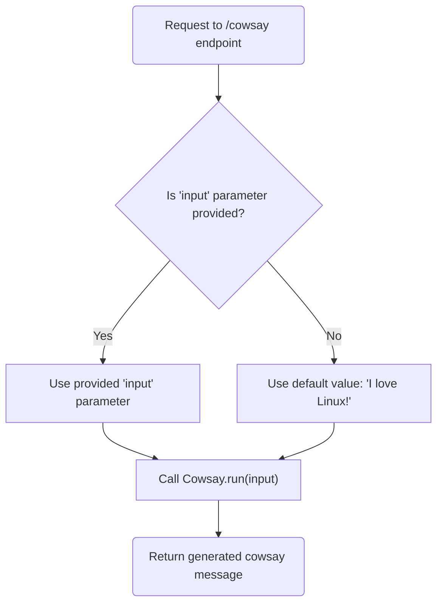
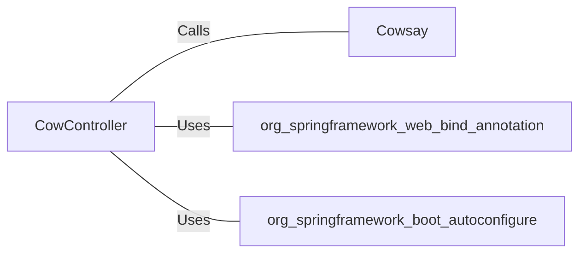

# CowController.java: REST Controller for CowSay Functionality

## Overview
The `CowController` class is a REST controller that provides an endpoint for generating "cowsay" messages. It uses the `@RequestMapping` annotation to define a single endpoint (`/cowsay`) that accepts a query parameter (`input`) and returns a string generated by the `Cowsay.run()` method.

## Process Flow

## Insights
- The class is annotated with `@RestController` and `@EnableAutoConfiguration`, making it a Spring Boot REST controller with auto-configuration enabled.
- The `/cowsay` endpoint accepts a query parameter `input`. If no value is provided, it defaults to `"I love Linux!"`.
- The `Cowsay.run()` method is responsible for generating the cowsay message, but its implementation is not provided in this snippet.
- The `input` parameter is directly passed to `Cowsay.run()`, which could lead to potential vulnerabilities if `Cowsay.run()` does not sanitize or validate the input.

## Vulnerabilities
1. **Potential Command Injection**:
   - If `Cowsay.run()` executes system commands or interacts with external processes, unsanitized user input could lead to command injection vulnerabilities.
   - Example: If `Cowsay.run()` uses the input in a shell command, malicious input like `"; rm -rf /"` could be executed.

2. **Cross-Site Scripting (XSS)**:
   - If the generated cowsay message is displayed in a web application without proper escaping, it could lead to XSS attacks.

3. **Denial of Service (DoS)**:
   - Large or malformed input could potentially cause performance issues or crashes if `Cowsay.run()` does not handle such cases gracefully.

## Dependencies

- `Cowsay`: Responsible for generating the cowsay message. The nature of its implementation is unknown.
- `org.springframework.web.bind.annotation`: Provides annotations for mapping web requests to handler methods.
- `org.springframework.boot.autoconfigure`: Enables Spring Boot auto-configuration.

## External References
- `Cowsay`: Accepts the `input` parameter and generates a cowsay message. The exact implementation and behavior are not provided.
- `org.springframework.web.bind.annotation`: Used for defining REST endpoints and handling HTTP requests.
- `org.springframework.boot.autoconfigure`: Used for enabling Spring Boot auto-configuration.
