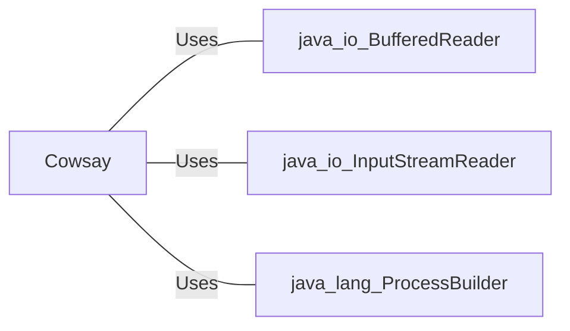

# Cowsay.java: Command Execution Wrapper for Cowsay

## Overview
The `Cowsay` class provides functionality to execute the `cowsay` command-line tool, which generates ASCII art of a cow saying a given input message. It uses Java's `ProcessBuilder` to execute the command and captures the output.

## Process Flow

```mermaid
flowchart TD
    Start("Start: Input Message")
    BuildCommand["Build Command: '/usr/games/cowsay <input>'"]
    ExecuteCommand["Execute Command using ProcessBuilder"]
    CaptureOutput["Capture Output from Process"]
    ReturnOutput("Return ASCII Art Output")
    
    Start --> BuildCommand
    BuildCommand --> ExecuteCommand
    ExecuteCommand --> CaptureOutput
    CaptureOutput --> ReturnOutput
```

## Insights
- **Command Construction**: The command is dynamically constructed using the input string, which is directly embedded into the command string.
- **Process Execution**: The `ProcessBuilder` is used to execute the command in a bash shell.
- **Output Handling**: The output of the command is read line-by-line using a `BufferedReader` and appended to a `StringBuilder`.
- **Error Handling**: Exceptions during process execution are caught and printed to the standard error stream using `e.printStackTrace()`.

## Vulnerabilities
1. **Command Injection**:
   - The input string is directly concatenated into the command without sanitization, making the code vulnerable to command injection attacks. For example, an input like `"; rm -rf /"` could execute malicious commands.
   - **Mitigation**: Use proper input validation or escape special characters in the input string.

2. **Hardcoded Command Path**:
   - The path to the `cowsay` executable (`/usr/games/cowsay`) is hardcoded, which may not be portable across different systems.
   - **Mitigation**: Use configuration files or environment variables to specify the path.

3. **Error Handling**:
   - The error handling mechanism only prints the stack trace, which may not be sufficient for production environments.
   - **Mitigation**: Implement proper logging and user-friendly error messages.

4. **Resource Management**:
   - The `BufferedReader` is not explicitly closed, which could lead to resource leaks.
   - **Mitigation**: Use try-with-resources to ensure proper resource management.

## Dependencies

- `java.io.BufferedReader`: Used to read the output of the executed process.
- `java.io.InputStreamReader`: Wraps the input stream of the process for character-based reading.
- `java.lang.ProcessBuilder`: Used to create and manage the execution of the external command.

## Data Manipulation (SQL) (Optional)
No SQL data manipulation is present in this code.
