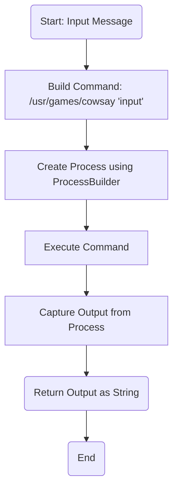
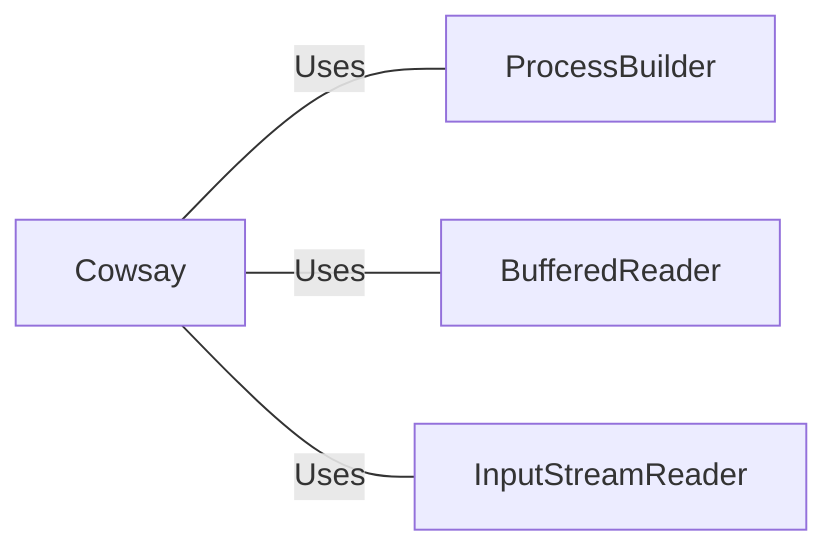

# Cowsay.java: Command Execution Wrapper for Cowsay

## Overview
The `Cowsay` class provides functionality to execute the `cowsay` command-line tool, which generates ASCII art of a cow saying a given input message. It uses Java's `ProcessBuilder` to execute the command and captures the output.

## Process Flow

## Insights
- **Command Injection Vulnerability**: The code concatenates user input directly into the command string without sanitization, making it vulnerable to command injection attacks. Malicious input could execute arbitrary commands on the host system.
- **Error Handling**: The code catches exceptions but only prints the stack trace, which may not be sufficient for production environments. Proper logging and error handling should be implemented.
- **Hardcoded Command Path**: The path `/usr/games/cowsay` is hardcoded, which may not be portable across different systems. Consider parameterizing or validating the path.
- **Resource Management**: The `BufferedReader` is not closed explicitly, which could lead to resource leaks. Use try-with-resources for better resource management.

## Vulnerabilities
1. **Command Injection**:
   - The input is directly concatenated into the command string, allowing attackers to inject malicious commands.
   - Example: If `input` is `"hello; rm -rf /"`, the resulting command would execute `rm -rf /` on the host system.

2. **Resource Leak**:
   - The `BufferedReader` is not closed explicitly, which could lead to resource leaks.

3. **Error Handling**:
   - The exception handling only prints the stack trace, which is insufficient for production-grade applications.

## Dependencies

- `ProcessBuilder`: Used to create and execute the external `cowsay` command.
- `BufferedReader`: Reads the output of the executed command.
- `InputStreamReader`: Converts the process's input stream into a readable format.

## Recommendations
- **Sanitize Input**: Validate and sanitize user input to prevent command injection.
- **Use Try-With-Resources**: Ensure proper resource management by using try-with-resources for `BufferedReader`.
- **Improve Error Handling**: Implement robust logging and error handling mechanisms.
- **Parameterize Command Path**: Make the command path configurable to improve portability.
