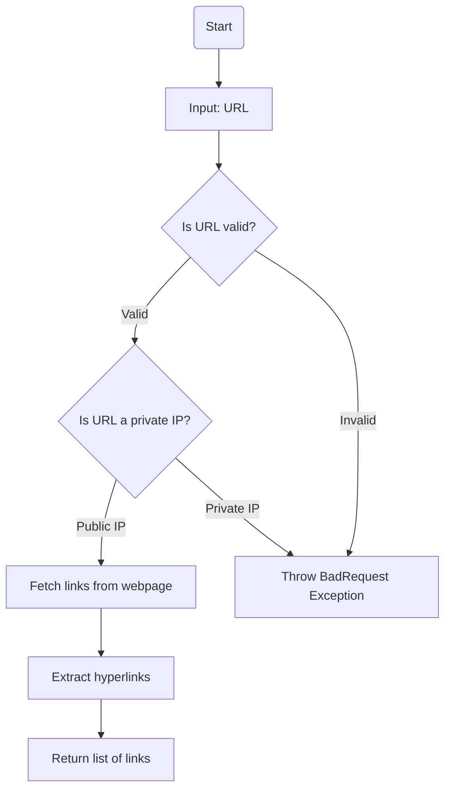
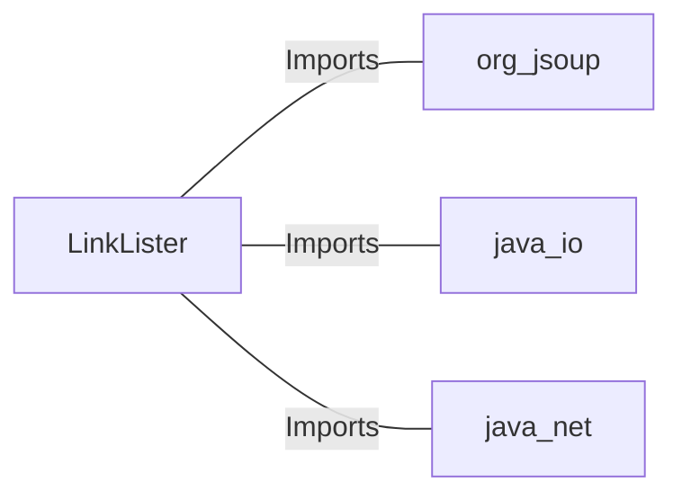

# LinkLister.java: Web Link Extractor

## Overview
The `LinkLister` class is responsible for extracting hyperlinks from a given webpage URL. It provides two methods:
1. `getLinks`: Extracts all hyperlinks from the provided URL.
2. `getLinksV2`: Adds validation to ensure the URL does not point to a private IP address before extracting hyperlinks.

## Process Flow

## Insights
- **Private IP Validation**: The `getLinksV2` method ensures that URLs pointing to private IP addresses (e.g., `172.x.x.x`, `192.168.x.x`, `10.x.x.x`) are rejected for security reasons.
- **HTML Parsing**: The class uses the `Jsoup` library to parse HTML and extract hyperlinks.
- **Error Handling**: The `getLinksV2` method throws a custom `BadRequest` exception for invalid URLs or private IPs.
- **Potential Vulnerability**: The `getLinks` method does not validate the URL, which could lead to security risks such as SSRF (Server-Side Request Forgery).

## Dependencies

- `org.jsoup`: Used for HTML parsing and extracting elements from the webpage.
- `java.io`: Handles input/output operations, such as exceptions related to IO.
- `java.net`: Provides utilities for URL validation and manipulation.

## Vulnerabilities
1. **SSRF (Server-Side Request Forgery)**:
   - The `getLinks` method directly connects to the provided URL without validation, which could allow an attacker to exploit SSRF by providing malicious URLs.
   - Mitigation: Validate the URL before connecting, similar to the checks in `getLinksV2`.

2. **Unrestricted External Connections**:
   - The `getLinks` method does not restrict connections to external domains, which could lead to abuse or unintended behavior.
   - Mitigation: Implement domain whitelisting or additional validation.

3. **Error Handling in `getLinksV2`**:
   - The `getLinksV2` method catches all exceptions and wraps them in a `BadRequest` exception. This could lead to loss of specific error details.
   - Mitigation: Log the original exception or provide more granular error handling.

## Data Manipulation (SQL)
Not applicable. This code does not interact with any database or perform SQL operations.
