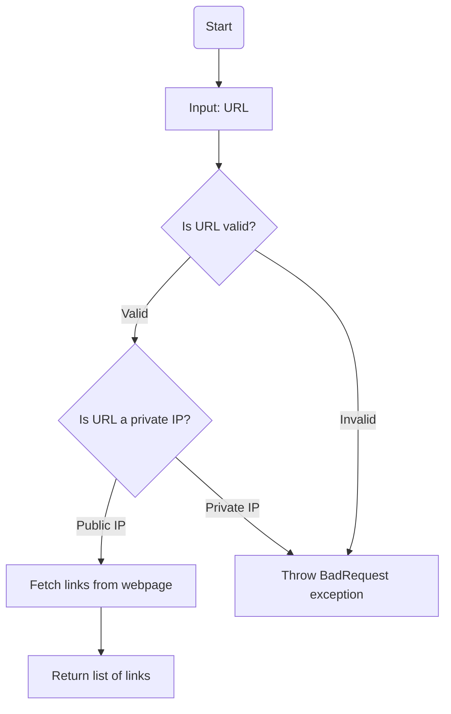
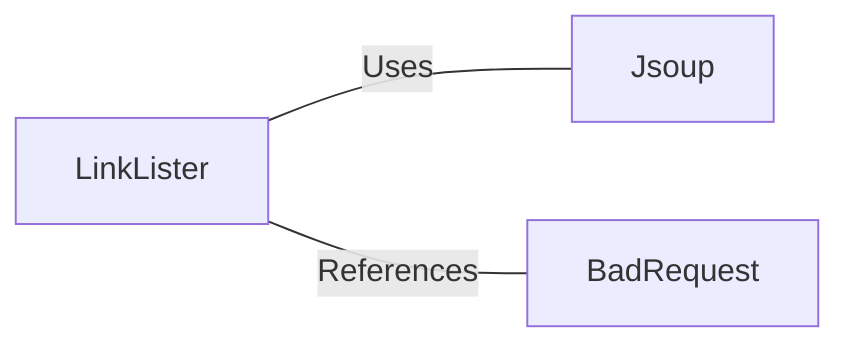

# LinkLister.java: Web Link Extractor

## Overview
The `LinkLister` class is designed to extract hyperlinks from a given webpage URL. It provides two methods for retrieving links:
1. `getLinks`: Extracts all hyperlinks from the provided URL.
2. `getLinksV2`: Adds validation to ensure the URL does not point to a private IP address before extracting links.

## Process Flow

## Insights
- **HTML Parsing**: The class uses the `Jsoup` library to parse HTML and extract hyperlinks.
- **Private IP Validation**: `getLinksV2` ensures that the URL does not point to a private IP address, enhancing security.
- **Error Handling**: `getLinksV2` throws a custom `BadRequest` exception for invalid URLs or private IPs.
- **Potential Vulnerability**: The `getLinks` method does not validate the input URL, which could lead to security risks such as SSRF (Server-Side Request Forgery).

## Vulnerabilities
1. **SSRF Risk in `getLinks`**:
   - The `getLinks` method directly connects to the provided URL without validation, making it susceptible to SSRF attacks.
   - An attacker could exploit this by providing a URL that targets internal services or sensitive endpoints.

2. **Insufficient Exception Handling in `getLinksV2`**:
   - While `getLinksV2` validates private IPs, it does not handle other potentially malicious URLs (e.g., loopback addresses like `127.0.0.1` or `localhost`).

3. **Logging Sensitive Information**:
   - The `getLinksV2` method logs the host of the URL using `System.out.println`, which could expose sensitive information in production environments.

## Dependencies

- `Jsoup`: Used for HTML parsing and extracting links from the webpage.
- `BadRequest`: Custom exception class used for error handling in `getLinksV2`.

## Data Manipulation (SQL)
No SQL operations or database interactions are present in this code.
