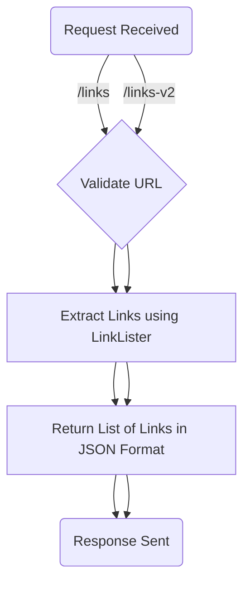
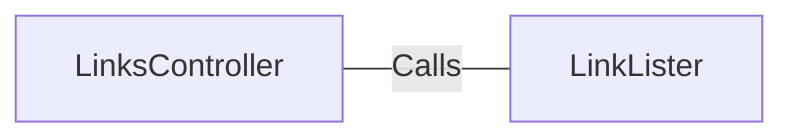

# LinksController.java: REST API for Extracting Links

## Overview
The `LinksController` class is a REST API controller designed to handle HTTP requests for extracting links from a given URL. It provides two endpoints (`/links` and `/links-v2`) that process URLs and return a list of links in JSON format. The class uses methods from the `LinkLister` utility to perform the actual link extraction.

## Process Flow

## Insights
- The class is annotated with `@RestController` and `@EnableAutoConfiguration`, making it a Spring Boot REST controller with automatic configuration.
- Two endpoints are defined:
  - `/links`: Extracts links using the `LinkLister.getLinks` method.
  - `/links-v2`: Extracts links using the `LinkLister.getLinksV2` method, which may have additional validation or functionality.
- Both endpoints accept a `url` parameter via `@RequestParam` and return a list of links in JSON format.
- The `/links-v2` endpoint throws a custom `BadRequest` exception, indicating stricter validation or error handling compared to `/links`.

## Dependencies

- `LinkLister`: Utility class responsible for extracting links from the provided URL. The methods `getLinks` and `getLinksV2` are invoked by the controller.

## Vulnerabilities
- **Potential for URL Injection**: The `url` parameter is directly passed to the `LinkLister` methods without validation. This could lead to security issues such as SSRF (Server-Side Request Forgery) if the `LinkLister` methods do not properly sanitize or validate the input.
- **IOException Handling**: The `links` method throws `IOException`, but there is no explicit error handling or logging, which could lead to unhandled exceptions and obscure debugging.
- **BadRequest Exception**: The `linksV2` method throws a `BadRequest` exception, but the implementation of this exception is not shown. If not properly handled, it could result in unclear error responses to the client.
- **Lack of Authentication/Authorization**: The endpoints are publicly accessible, which could expose the service to unauthorized usage or abuse.
- **No Rate Limiting**: The controller does not implement rate limiting, making it susceptible to abuse through excessive requests.

## Recommendations
- Validate and sanitize the `url` parameter to prevent SSRF and other injection attacks.
- Implement proper exception handling and logging for `IOException` and `BadRequest`.
- Add authentication and authorization mechanisms to restrict access to the endpoints.
- Consider implementing rate limiting to prevent abuse.
- Ensure the `LinkLister` methods are secure and handle edge cases effectively.
