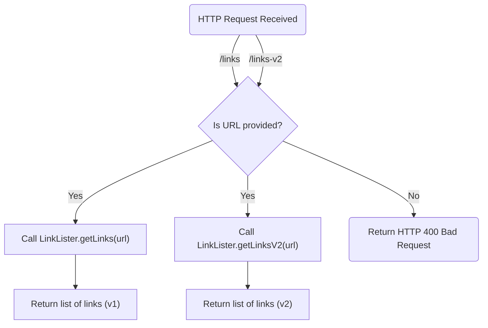
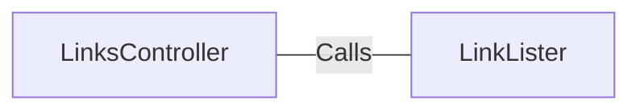

# LinksController.java: REST API for Link Extraction

## Overview
The `LinksController` class is a REST API controller designed to handle HTTP requests for extracting links from a given URL. It provides two endpoints (`/links` and `/links-v2`) that utilize different methods for link extraction. The class is built using Spring Boot and is annotated with `@RestController` and `@EnableAutoConfiguration`.

## Process Flow

## Insights
- The class provides two endpoints:
  - `/links`: Extracts links using the `LinkLister.getLinks(url)` method.
  - `/links-v2`: Extracts links using the `LinkLister.getLinksV2(url)` method.
- Both endpoints expect a `url` parameter as input.
- The `/links-v2` endpoint throws a custom `BadRequest` exception if the input is invalid.
- The `LinkLister` class is assumed to contain the logic for extracting links, but its implementation is not provided in this snippet.
- The `@EnableAutoConfiguration` annotation automatically configures Spring Boot based on the dependencies present in the classpath.

## Dependencies

- `LinkLister`: Provides methods `getLinks(url)` and `getLinksV2(url)` for extracting links from the given URL.

## Vulnerabilities
- **Potential for Open Redirect or SSRF (Server-Side Request Forgery):** The `url` parameter is directly passed to the `LinkLister` methods without validation. This could allow malicious URLs to be processed, leading to security risks such as SSRF or open redirect attacks.
- **Lack of Input Validation:** The `url` parameter is not validated for format or safety. This could lead to unexpected behavior or exploitation.
- **Error Handling in `/links`:** Unlike `/links-v2`, the `/links` endpoint does not handle invalid input gracefully. It may throw unhandled exceptions, leading to server errors.
- **Exception Handling:** The `IOException` thrown by the `/links` endpoint is not mapped to a specific HTTP status code, which could result in generic error responses that are not user-friendly.
