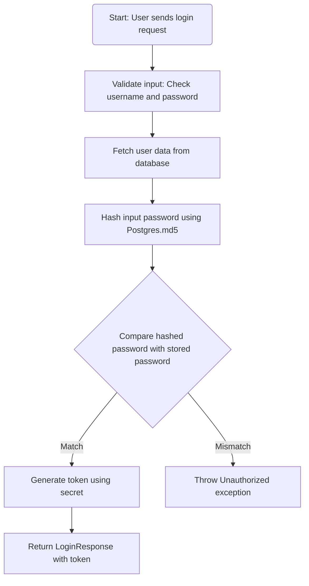
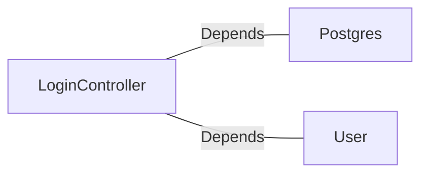

# LoginController.java: Login Authentication Controller

## Overview
The `LoginController` class is a REST API controller responsible for handling user login requests. It validates user credentials against stored data and generates a token for successful authentication. The controller uses Spring Boot annotations and integrates with external dependencies for user data fetching and password hashing.

## Process Flow

## Insights
- **Cross-Origin Resource Sharing (CORS):** The `@CrossOrigin` annotation allows requests from any origin, which may pose security risks if not properly configured.
- **Hardcoded Secret Dependency:** The `secret` is injected via `@Value("${app.secret}")`. Ensure the secret is securely stored and not exposed in the environment.
- **Password Hashing:** The password is hashed using `Postgres.md5`. Ensure the hashing algorithm is robust and not outdated.
- **Error Handling:** Unauthorized access results in a custom `Unauthorized` exception with HTTP status `401`.
- **Serialization:** Both `LoginRequest` and `LoginResponse` implement `Serializable`, enabling easy data transfer.

## Dependencies

- `Postgres`: Used for hashing passwords via the `md5` method.
- `User`: Fetches user data from the database, including the hashed password and token generation.

## Vulnerabilities
1. **CORS Misconfiguration:**
   - The `@CrossOrigin(origins = "*")` allows requests from any origin, which can lead to security vulnerabilities such as Cross-Site Request Forgery (CSRF). It is recommended to restrict origins to trusted domains.

2. **Weak Password Hashing:**
   - The use of `Postgres.md5` for password hashing may not be secure against modern attacks. Consider using a stronger hashing algorithm like bcrypt or Argon2.

3. **Error Disclosure:**
   - The `Unauthorized` exception may expose sensitive information if not properly handled. Ensure error messages do not reveal details about the authentication process.

4. **Hardcoded Secret Management:**
   - The `secret` is injected via environment variables but could be exposed if not securely managed. Use a secure vault or secret management system.

5. **Lack of Rate Limiting:**
   - The login endpoint does not implement rate limiting, making it vulnerable to brute-force attacks.

6. **Token Generation Logic:**
   - The token generation logic is abstracted in the `User.token(secret)` method. Ensure the token is securely generated and follows best practices for session management.

## Data Manipulation (SQL)
- **User Data Fetching:** The `User.fetch(input.username)` method retrieves user data from the database. Ensure proper sanitization to prevent SQL injection.
