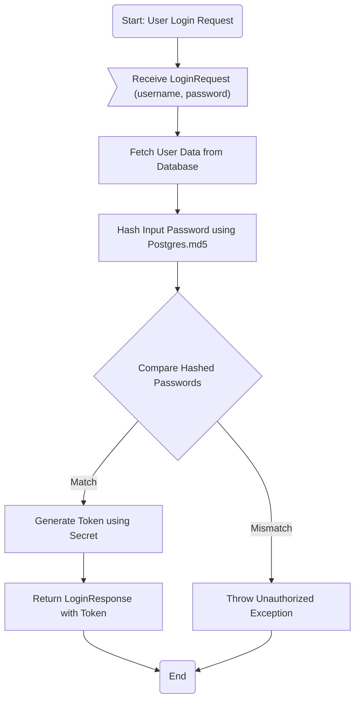
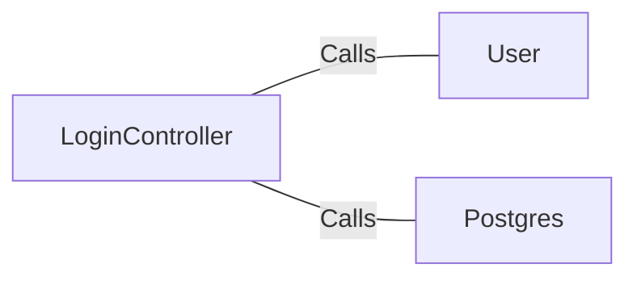

# LoginController.java: Login Management Controller

## Overview
The `LoginController` class is a REST API controller responsible for handling user login requests. It validates user credentials against stored data and generates a token for successful authentication. The controller uses Spring Boot annotations and integrates with external dependencies for user data fetching and password hashing.

## Process Flow

## Insights
- The `@CrossOrigin` annotation allows requests from any origin, which may pose security risks if not properly configured.
- Password hashing is performed using `Postgres.md5`, which is considered weak and outdated for secure password storage.
- The `secret` value is injected from application properties and used to generate tokens, but its security depends on proper configuration and storage.
- The `LoginController` directly interacts with the `User` class and `Postgres` utility, which are external dependencies.
- The `Unauthorized` exception is thrown for invalid credentials, returning an HTTP 401 status code.

## Dependencies

- `User`: Fetches user data based on the provided username. It is used to retrieve the hashed password and token generation logic.
- `Postgres`: Provides the `md5` method for hashing passwords. It is used to hash the input password for comparison.

## Vulnerabilities
1. **Weak Password Hashing**:
   - The use of `Postgres.md5` for password hashing is insecure. MD5 is vulnerable to collision attacks and should be replaced with a stronger algorithm like bcrypt or Argon2.

2. **Unrestricted Cross-Origin Resource Sharing (CORS)**:
   - The `@CrossOrigin(origins = "*")` annotation allows requests from any origin, which can expose the application to Cross-Site Request Forgery (CSRF) attacks. It is recommended to restrict origins to trusted domains.

3. **Hardcoded Secret Injection**:
   - The `secret` value is injected from application properties but may be vulnerable if not stored securely. Consider using environment variables or a secure vault for sensitive configurations.

4. **Potential User Enumeration**:
   - The `User.fetch(input.username)` method may allow attackers to enumerate valid usernames if error messages or response times differ for valid and invalid usernames.

5. **Lack of Rate Limiting**:
   - The login endpoint does not implement rate limiting, making it susceptible to brute-force attacks.

6. **Token Generation Logic**:
   - The token generation logic is not shown in the code but should be reviewed to ensure it uses secure algorithms and practices.

## Data Manipulation (SQL)
- **User**: The `User.fetch` method likely performs a SELECT operation to retrieve user data based on the provided username.
