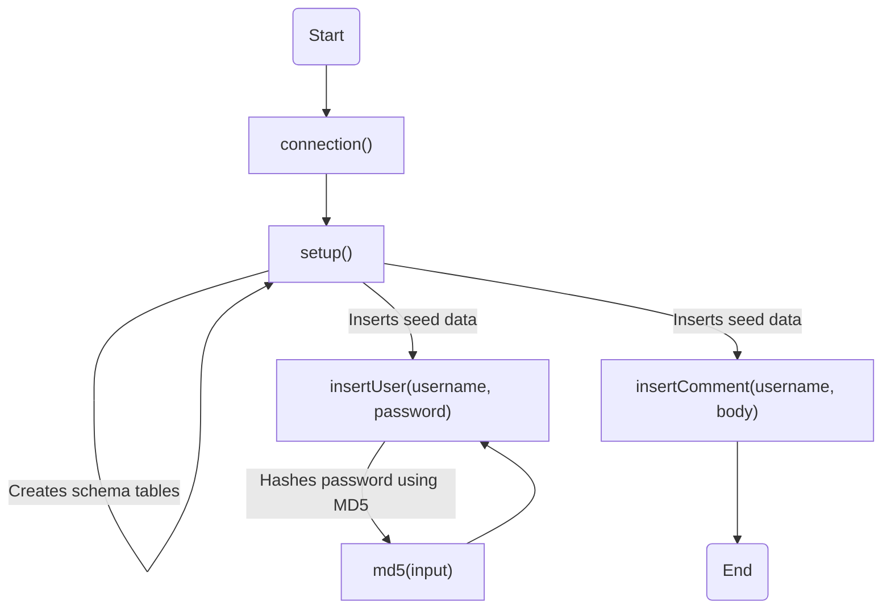
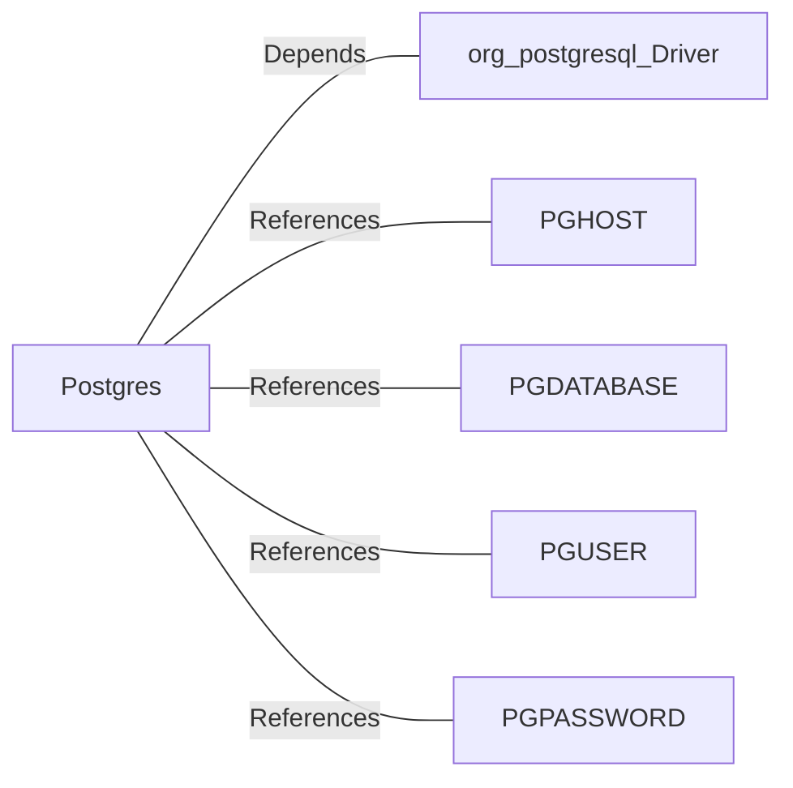

# Postgres.java: Database Setup and Interaction Utility

## Overview
The `Postgres` class is responsible for setting up and interacting with a PostgreSQL database. It provides methods to establish a database connection, create schema tables, insert seed data, and perform basic operations such as inserting users and comments. Additionally, it includes a utility method for generating MD5 hash values.

## Process Flow

## Insights
- **Database Connection**: The `connection()` method dynamically constructs the database connection string using environment variables (`PGHOST`, `PGDATABASE`, `PGUSER`, `PGPASSWORD`).
- **Schema Creation**: The `setup()` method creates two tables (`users` and `comments`) if they do not already exist.
- **Seed Data**: The `setup()` method inserts predefined users and comments into the database for initialization.
- **Password Hashing**: The `md5()` method hashes passwords using the MD5 algorithm before storing them in the database.
- **UUID Generation**: Both `insertUser()` and `insertComment()` use `UUID.randomUUID()` to generate unique identifiers for records.
- **Error Handling**: Exceptions are caught and printed, but the program does not implement robust error recovery mechanisms.
- **Potential Vulnerabilities**:
  - **MD5 for Password Hashing**: MD5 is considered cryptographically weak and should not be used for password hashing. A stronger algorithm like bcrypt or Argon2 is recommended.
  - **Environment Variable Exposure**: Sensitive database credentials are retrieved from environment variables, which could be exposed if not properly secured.
  - **Hardcoded Seed Data**: The hardcoded passwords in `setup()` could lead to security risks if used in production.
  - **Lack of Input Validation**: The `insertUser()` and `insertComment()` methods do not validate input, potentially allowing SQL injection or other attacks.

## Dependencies

- `org.postgresql.Driver`: Required for establishing a connection to the PostgreSQL database.
- `PGHOST`: Environment variable specifying the database host.
- `PGDATABASE`: Environment variable specifying the database name.
- `PGUSER`: Environment variable specifying the database user.
- `PGPASSWORD`: Environment variable specifying the database password.

## Data Manipulation (SQL)
### Table Structures
#### `users`
| Attribute   | Type          | Description                                      |
|-------------|---------------|--------------------------------------------------|
| `user_id`   | `VARCHAR(36)` | Primary key, unique identifier for the user.     |
| `username`  | `VARCHAR(50)` | Unique username for the user.                    |
| `password`  | `VARCHAR(50)` | MD5-hashed password.                             |
| `created_on`| `TIMESTAMP`   | Timestamp when the user was created.             |
| `last_login`| `TIMESTAMP`   | Timestamp of the user's last login.              |

#### `comments`
| Attribute   | Type          | Description                                      |
|-------------|---------------|--------------------------------------------------|
| `id`        | `VARCHAR(36)` | Primary key, unique identifier for the comment.  |
| `username`  | `VARCHAR(36)` | Username of the user who made the comment.       |
| `body`      | `VARCHAR(500)`| Content of the comment.                          |
| `created_on`| `TIMESTAMP`   | Timestamp when the comment was created.          |

### SQL Operations
- `CREATE TABLE`: Creates `users` and `comments` tables if they do not exist.
- `DELETE`: Removes all existing data from `users` and `comments` tables during setup.
- `INSERT`: Adds seed data to `users` and `comments` tables.
