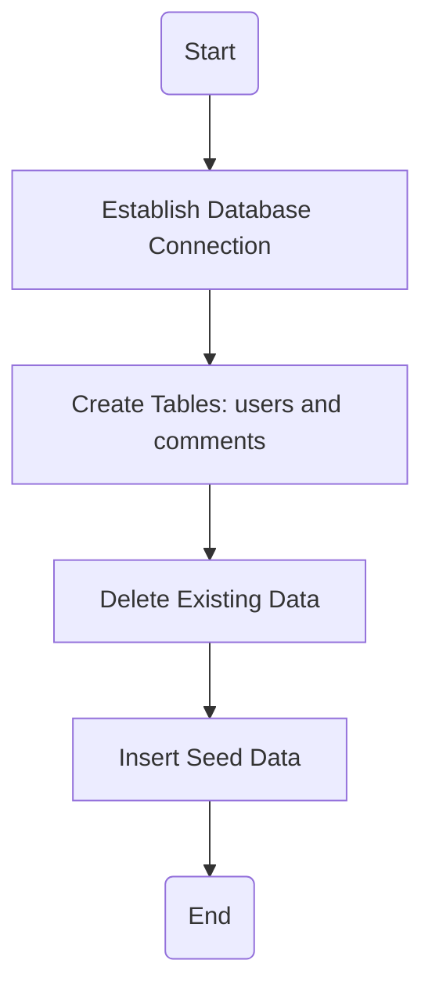
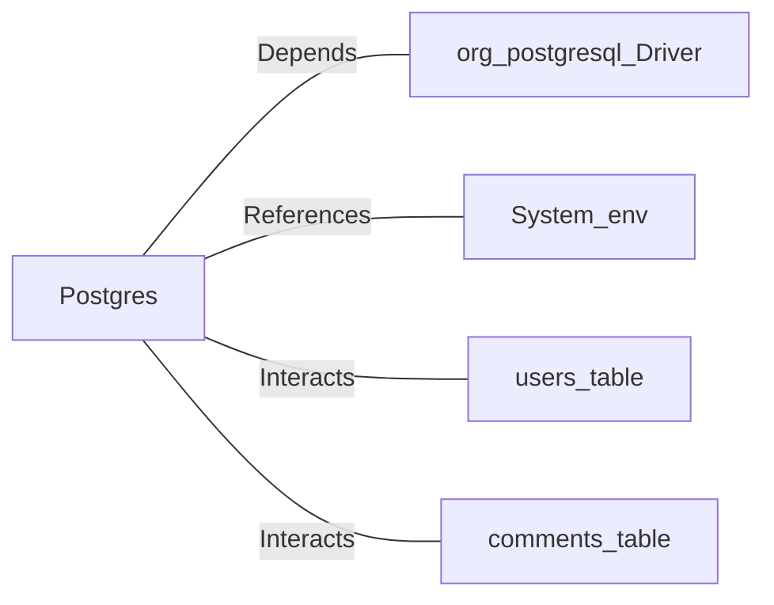

# Postgres.java: Database Setup and Interaction Utility

## Overview
This Java program provides utility methods for setting up and interacting with a PostgreSQL database. It includes functionality for establishing database connections, creating schemas, inserting seed data, and hashing passwords using MD5. The program is designed to initialize a database with predefined tables and seed data for users and comments.

## Process Flow

## Insights
- **Database Connection**: The program dynamically constructs the database connection string using environment variables (`PGHOST`, `PGDATABASE`, `PGUSER`, `PGPASSWORD`).
- **Schema Creation**: Two tables (`users` and `comments`) are created if they do not already exist.
- **Seed Data**: Predefined users and comments are inserted into the database for testing or initialization purposes.
- **Password Hashing**: User passwords are hashed using MD5 before being stored in the database.
- **Error Handling**: Exceptions are caught and printed, but the program exits on critical errors, such as connection failures.
- **UUID Usage**: Unique identifiers for users and comments are generated using `UUID.randomUUID()`.

## Vulnerabilities
1. **MD5 for Password Hashing**:
   - MD5 is considered cryptographically insecure and vulnerable to collision attacks. It should not be used for password hashing. Consider using a stronger algorithm like bcrypt or Argon2.

2. **Hardcoded Seed Data**:
   - The program inserts hardcoded usernames and passwords, which could lead to security risks if used in production. Ensure these are only used in development environments.

3. **Environment Variable Exposure**:
   - The program relies on environment variables for database credentials. Ensure these variables are securely managed and not exposed in logs or error messages.

4. **Lack of Input Validation**:
   - The program does not validate inputs for `insertUser` and `insertComment`. This could lead to SQL injection or other vulnerabilities if the inputs are not sanitized.

5. **Error Handling**:
   - Exceptions are printed to the console, which could expose sensitive information. Consider logging errors securely and avoiding direct output to the console.

## Dependencies

- `org.postgresql.Driver`: Used for establishing a connection to the PostgreSQL database.
- `System.env`: Environment variables (`PGHOST`, `PGDATABASE`, `PGUSER`, `PGPASSWORD`) are used to configure the database connection.
- `users_table`: Table for storing user information, including hashed passwords.
- `comments_table`: Table for storing user comments.

## Data Manipulation (SQL)
### Table Structures
#### `users`
| Attribute   | Type          | Description                                      |
|-------------|---------------|--------------------------------------------------|
| `user_id`   | `VARCHAR(36)` | Primary key, unique identifier for the user.     |
| `username`  | `VARCHAR(50)` | Unique username for the user.                    |
| `password`  | `VARCHAR(50)` | MD5-hashed password.                             |
| `created_on`| `TIMESTAMP`   | Timestamp of user creation.                      |
| `last_login`| `TIMESTAMP`   | Timestamp of the last login.                    |

#### `comments`
| Attribute   | Type          | Description                                      |
|-------------|---------------|--------------------------------------------------|
| `id`        | `VARCHAR(36)` | Primary key, unique identifier for the comment.  |
| `username`  | `VARCHAR(36)` | Username of the commenter.                       |
| `body`      | `VARCHAR(500)`| Content of the comment.                          |
| `created_on`| `TIMESTAMP`   | Timestamp of comment creation.                   |

### SQL Operations
- `CREATE TABLE`: Creates `users` and `comments` tables if they do not exist.
- `DELETE`: Removes all existing data from `users` and `comments` tables.
- `INSERT`: Adds seed data to `users` and `comments` tables.
