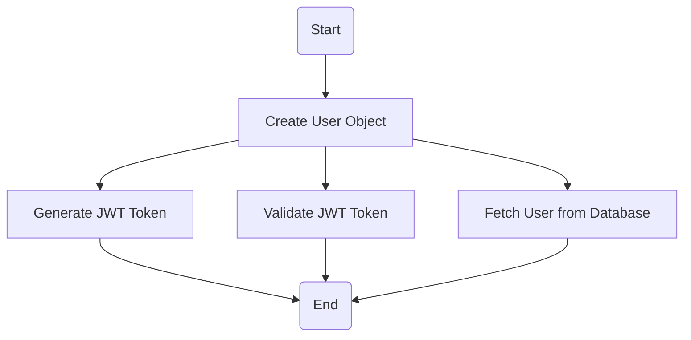
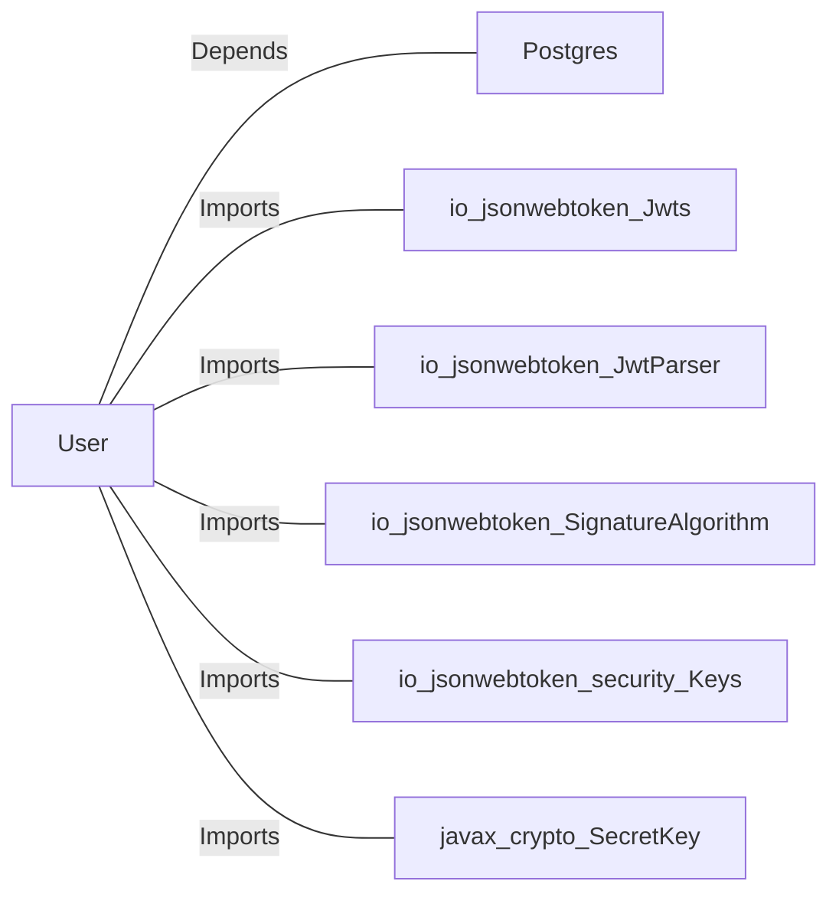

# User.java: User Management and Authentication

## Overview
The `User` class is responsible for managing user-related data and operations, including token generation, authentication, and fetching user details from a database. It provides methods for creating JSON Web Tokens (JWTs), validating tokens, and retrieving user information from a PostgreSQL database.

## Process Flow

## Insights
- **Token Generation**: The `token` method generates a JWT using the HMAC SHA key derived from the provided secret. It uses the username as the subject of the token.
- **Token Validation**: The `assertAuth` method validates a JWT token using the provided secret key. If validation fails, it throws an `Unauthorized` exception.
- **Database Interaction**: The `fetch` method retrieves user details from a PostgreSQL database based on the username. It constructs a SQL query dynamically, which is vulnerable to SQL injection.
- **Error Handling**: The `fetch` method uses a `try-catch` block for error handling but does not rethrow exceptions, potentially masking issues during database operations.

## Dependencies

- `Postgres`: Provides the database connection used in the `fetch` method.
- `io.jsonwebtoken.Jwts`: Used for building and parsing JWTs.
- `io.jsonwebtoken.JwtParser`: Used for parsing JWTs during validation.
- `io.jsonwebtoken.SignatureAlgorithm`: Specifies the algorithm used for signing JWTs.
- `io.jsonwebtoken.security.Keys`: Used for generating HMAC SHA keys.
- `javax.crypto.SecretKey`: Represents the secret key used for signing and validating JWTs.

## Data Manipulation (SQL)
### Table Structure
The `fetch` method interacts with the `users` table. Below is the inferred structure based on the code:
| Attribute   | Data Type | Description                          |
|-------------|-----------|--------------------------------------|
| user_id     | String    | Unique identifier for the user.     |
| username    | String    | Username of the user.               |
| password    | String    | Hashed password of the user.        |

### SQL Command
- **Query**: `SELECT * FROM users WHERE username = '<username>' LIMIT 1`
  - **Operation**: SELECT
  - **Description**: Retrieves user details based on the provided username.

## Vulnerabilities
1. **SQL Injection**:
   - The `fetch` method constructs SQL queries using string concatenation, making it vulnerable to SQL injection attacks. An attacker could inject malicious SQL code via the `un` parameter.
   - **Mitigation**: Use prepared statements with parameterized queries to prevent SQL injection.

2. **Hardcoded Secret Key**:
   - The `token` and `assertAuth` methods rely on a secret key passed as a string. If the secret is not securely managed, it could lead to token forgery or compromise.
   - **Mitigation**: Store secrets securely using environment variables or a secrets management tool.

3. **Improper Exception Handling**:
   - The `fetch` method catches exceptions but does not rethrow or handle them appropriately, potentially masking critical errors.
   - **Mitigation**: Log errors and rethrow exceptions or return meaningful error responses.

4. **Weak Password Storage**:
   - The `fetch` method retrieves the `password` field directly from the database. If the password is not hashed securely, it could lead to credential theft.
   - **Mitigation**: Ensure passwords are hashed using a strong algorithm like bcrypt or Argon2 before storing them in the database.
