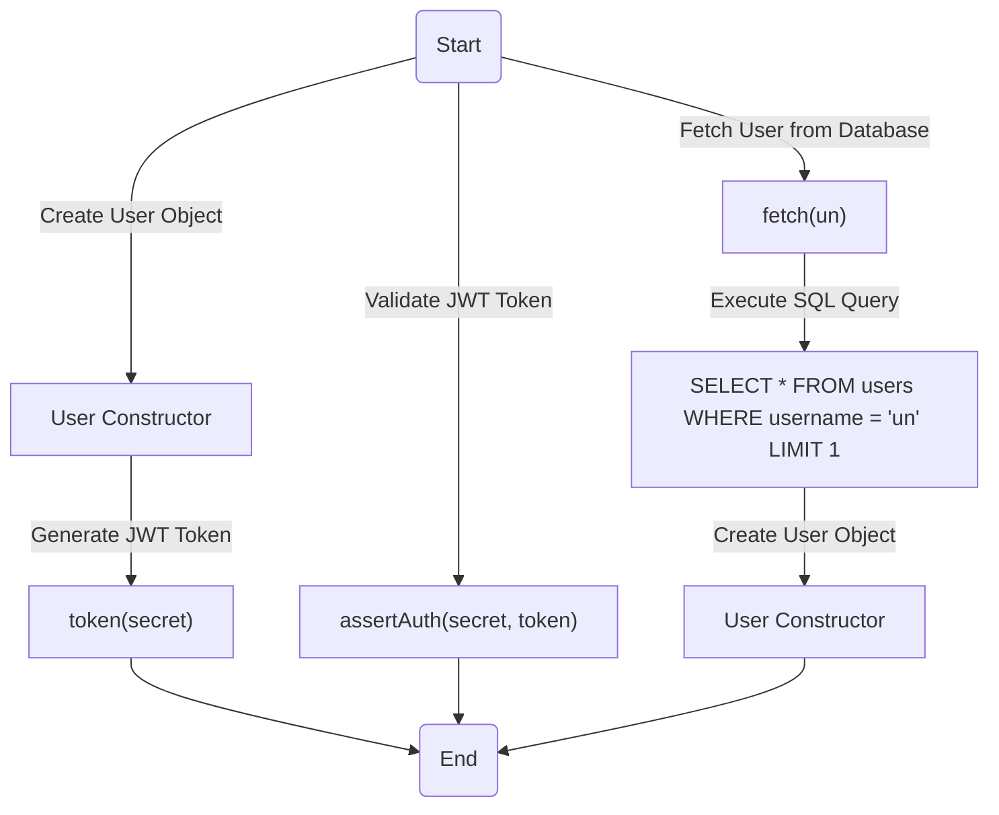
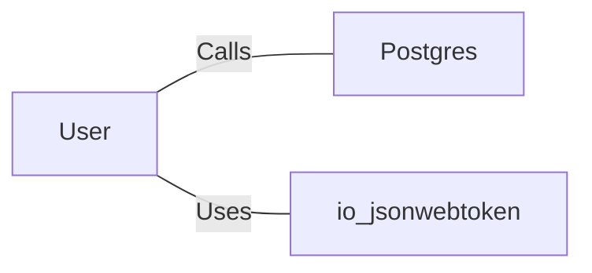

# User.java: User Management and Authentication

## Overview
The `User` class is responsible for managing user-related operations, including token generation, authentication, and fetching user details from a database. It provides methods for creating JSON Web Tokens (JWTs), validating tokens, and retrieving user information from a PostgreSQL database.

## Process Flow


## Insights
- **Token Generation**: The `token` method generates a JWT using the HMAC SHA key derived from the provided secret. The token includes the username as the subject.
- **Authentication**: The `assertAuth` method validates a JWT token using the provided secret key. If validation fails, it throws an `Unauthorized` exception.
- **Database Interaction**: The `fetch` method retrieves user details from a PostgreSQL database using a SQL query. It constructs a `User` object from the retrieved data.
- **Potential SQL Injection**: The `fetch` method constructs SQL queries using string concatenation, which makes it vulnerable to SQL injection attacks.
- **Error Handling**: Exceptions during database operations or token validation are logged and handled, but the `fetch` method returns `null` if an error occurs, which may lead to unexpected behavior.

## Dependencies


- `Postgres`: Provides the `connection()` method to establish a connection to the PostgreSQL database.
- `io.jsonwebtoken`: Used for creating and parsing JSON Web Tokens (JWTs).

## Data Manipulation (SQL)
### Table: `users`
| Attribute   | Type     | Description                          |
|-------------|----------|--------------------------------------|
| `user_id`   | String   | Unique identifier for the user.      |
| `username`  | String   | Username of the user.                |
| `password`  | String   | Hashed password of the user.         |

### SQL Command
- **SELECT**: Retrieves user details based on the username.
  ```sql
  SELECT * FROM users WHERE username = 'un' LIMIT 1;
  ```

## Vulnerabilities
1. **SQL Injection**:
   - The `fetch` method constructs SQL queries using string concatenation, which allows attackers to inject malicious SQL code.
   - **Mitigation**: Use prepared statements or parameterized queries to prevent SQL injection.

2. **Hardcoded Secret Key**:
   - The `token` and `assertAuth` methods rely on a secret key provided as a string. If the secret is not securely managed, it can lead to token forgery.
   - **Mitigation**: Store secrets securely using environment variables or a secrets management system.

3. **Weak Error Handling**:
   - The `fetch` method returns `null` if an exception occurs, which may lead to null pointer exceptions or unexpected behavior in dependent code.
   - **Mitigation**: Implement robust error handling and return meaningful error responses.

4. **Potential Key Management Issues**:
   - The `Keys.hmacShaKeyFor(secret.getBytes())` method assumes the secret is provided in a secure and valid format. Improper key management can compromise security.
   - **Mitigation**: Validate and securely manage the secret key.

5. **Logging Sensitive Information**:
   - The `fetch` method logs the SQL query, which may expose sensitive information in logs.
   - **Mitigation**: Avoid logging sensitive data or sanitize logs before writing them.
