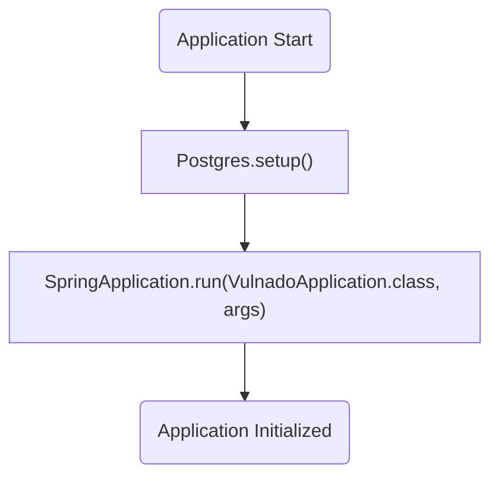
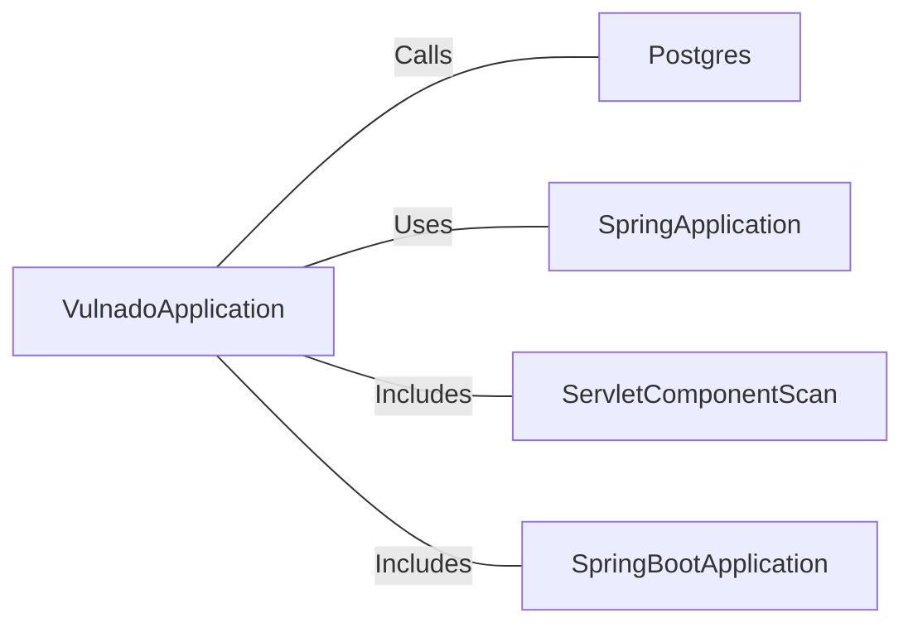

# VulnadoApplication.java: Spring Boot Application Entry Point

## Overview
The `VulnadoApplication` class serves as the entry point for a Spring Boot application. It initializes the application context and sets up necessary configurations, including database setup through the `Postgres.setup()` method. The class is annotated with `@SpringBootApplication` and `@ServletComponentScan`, enabling Spring Boot's auto-configuration and scanning for servlet components.

## Process Flow

## Insights
- The `@SpringBootApplication` annotation combines three annotations: `@Configuration`, `@EnableAutoConfiguration`, and `@ComponentScan`, simplifying Spring Boot application setup.
- The `@ServletComponentScan` annotation enables scanning for servlet components, such as filters and listeners, within the application.
- The `Postgres.setup()` method is called before the Spring Boot application context is initialized, indicating that database setup is a prerequisite for application startup.
- The `main` method is the entry point for the Java application, and it delegates the initialization process to Spring Boot.

## Dependencies

- `Postgres`: The `setup()` method is called to configure the database before the application starts.
- `SpringApplication`: Used to bootstrap and launch the Spring Boot application.
- `ServletComponentScan`: Enables scanning for servlet components.
- `SpringBootApplication`: Provides auto-configuration and component scanning for the application.

## Vulnerabilities
- **Potential Database Misconfiguration**: The `Postgres.setup()` method is invoked, but its implementation is not provided in this snippet. If the method does not handle exceptions or validate configurations properly, it could lead to runtime errors or security vulnerabilities.
- **Servlet Component Exposure**: The use of `@ServletComponentScan` may expose servlet components to external access if not properly secured. Ensure that all servlet components are configured with appropriate security measures.
- **Lack of Input Validation**: If `Postgres.setup()` or other components rely on external inputs (e.g., environment variables or configuration files), ensure proper validation to prevent injection attacks or misconfigurations.
