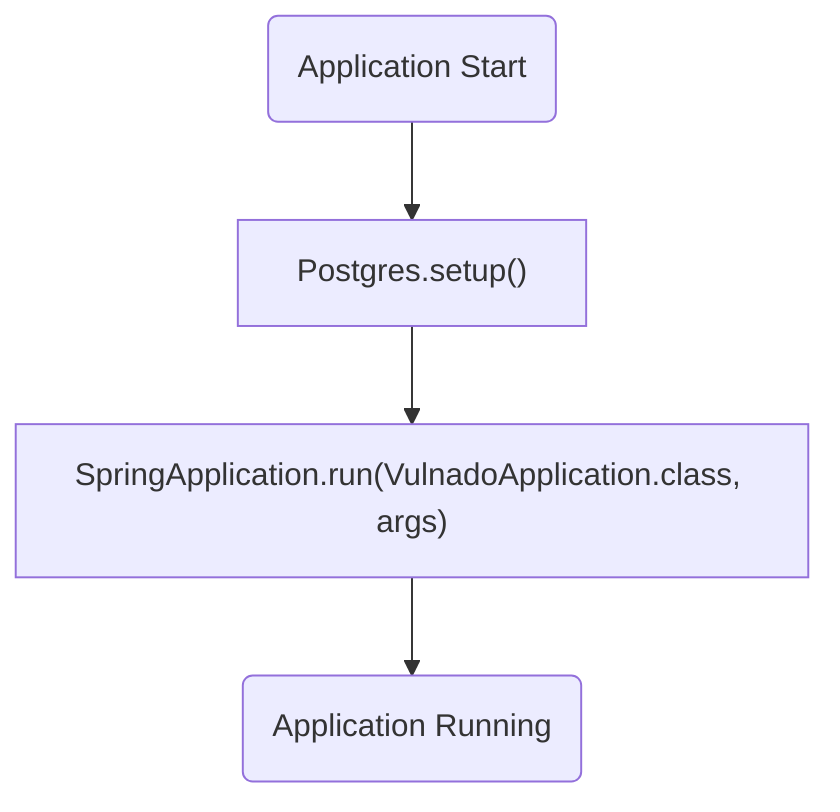
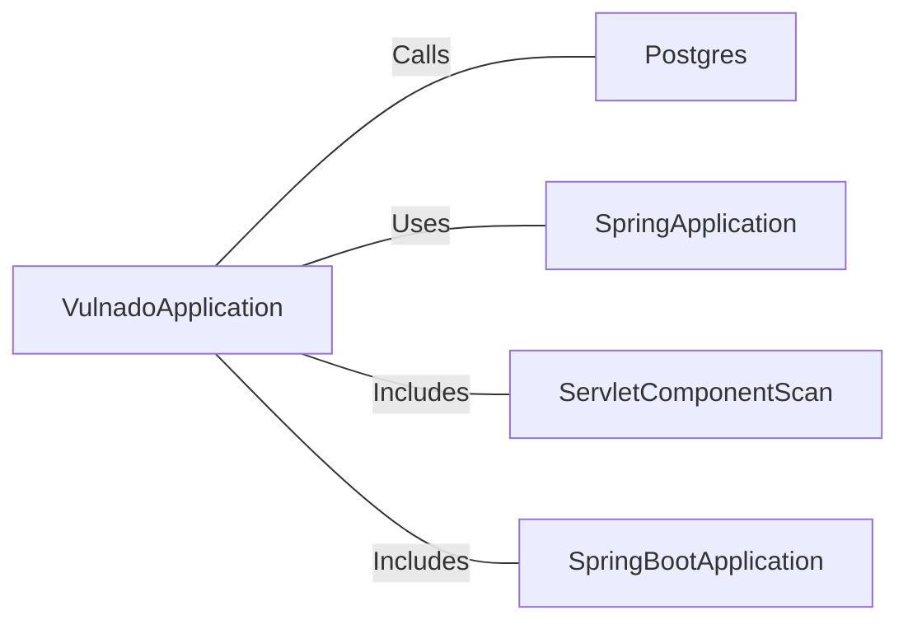

# VulnadoApplication.java: Spring Boot Application Entry Point

## Overview
The `VulnadoApplication` class serves as the entry point for a Spring Boot application. It initializes the application context and sets up necessary configurations, including database setup through the `Postgres.setup()` method. The class is annotated with `@SpringBootApplication` and `@ServletComponentScan`, enabling Spring Boot's auto-configuration and scanning for servlet components.

## Process Flow

## Insights
- The `@SpringBootApplication` annotation combines three annotations: `@Configuration`, `@EnableAutoConfiguration`, and `@ComponentScan`, simplifying Spring Boot application setup.
- The `@ServletComponentScan` annotation enables scanning for servlet components, such as filters and listeners, within the application.
- The `Postgres.setup()` method is invoked before the application context is initialized, indicating that database setup is a critical step in the application lifecycle.
- The `SpringApplication.run()` method starts the Spring Boot application, initializing the application context and starting the embedded server.

## Dependencies

- `Postgres`: The `setup()` method is called to configure the database before the application starts.
- `SpringApplication`: Used to bootstrap and launch the Spring Boot application.
- `ServletComponentScan`: Enables scanning for servlet components.
- `SpringBootApplication`: Provides auto-configuration and component scanning for the application.

## Vulnerabilities
- **Potential Database Misconfiguration**: The `Postgres.setup()` method is invoked without any validation or error handling in the provided code. If the database setup fails, it could lead to application startup issues or runtime errors.
- **Lack of Exception Handling**: The `main` method does not include exception handling, which could result in unhandled exceptions during application startup.
- **Implicit Dependency on Postgres**: The application assumes the presence of a `Postgres` class and its `setup()` method, which could lead to runtime errors if the class is missing or improperly implemented.
